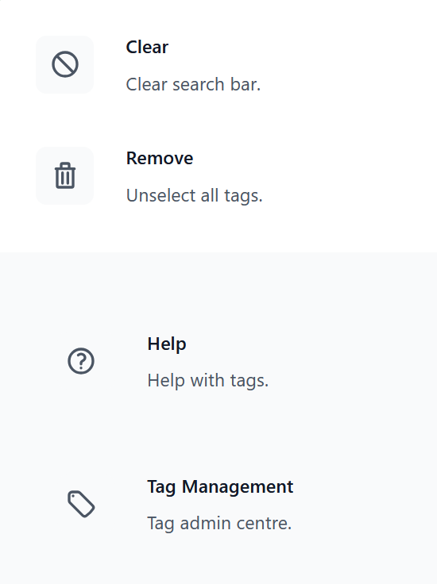

.. include:: ../extras.rst.txt
.. highlight:: rst
.. index:: how-to-config ; Index

.. _how-to-config:

=============
How to Config
=============

Overview
========

The ``tag_me`` app comes with sensible defaults, allowing you to start using
it right out of the box with minimal configuration. All settings are optional
and will use their default values if not specified in your ``settings.py``.

Some settings can be configured both globally (using Django settings) and
locally (using attributes in the form widget). In cases where both are
defined, the widget attribute takes precedence over the global setting.

This allows for flexible configuration, enabling you to define default
behavior globally while still allowing for customisation on a per-widget
basis.

|

Configuration Options: Global/Local
------------------------------------

|

===================================== ============================ ===============================================
Setting (in ``settings.py``)          Attribute (in widget)        Notes
===================================== ============================ ===============================================
``DJ_TAG_ME_MAX_NUMBER_DISPLAYED``    ``display_number_selected``  Controls the maximum number of displayed tags
``DJ_TAG_ME_TEMPLATES["default"]``    ``template_name``            Specifies the template for rendering the widget
===================================== ============================ ===============================================

|

TagMeCharField Attributes
=========================

|

.. code-block:: python

      from django.db import models
      from django.utils.translation import pgettext_lazy as _
      from tag_me.models.fields import TagMeCharField

      class MyModel(models.Model):

          class Visibility(models.TextChoices):
              """Issue Visibility choices."""

              PRIVATE = (
                  "PRIVATE",
                  _(
                      "Visibility",
                      "Private",
                  ),
              )

              PUBLIC = (
                  "PUBLIC",
                  _(
                      "Visibility",
                      "Public",
                  ),
              )

          tags:list = ['tag1', 'tag1']

          tagged_field_1=TagMeCharField(
              max_length=50,
              choices=Visibility.choices,
              default=Visibility.PRIVATE,
              system_tag=True,
              multiple=False,
              )

          synced_tagged_field_1=TagMeCharField(
              max_length=50,
              choices=tags,
              default='tag1',
              system_tag=True,
              display_number_selected=1,
              synchronise=True,
              )

|

*choices*
---------

**model.TextChoices**, *optional*
Accepts a TextChoices object and converts to a tag-me list format.

**list**, *optional*
Accepts a list object and converts to a tag-me list format.

.. note::

   When using ``choices``, you must also set ``system_tag=True`` to explicitly
   mark the field as a system tag (predefined choices) rather than a user tag
   (user-created). See :ref:`how-to-FK-based-lookup-system` for details.

|

*system_tag*
------------

**bool**, *optional:*
Whether this field uses predefined system tags (choices) rather than
user-created tags. ``Defaults to False``.

Must be set to ``True`` when using ``choices`` with TagMeCharField.

|

*multiple*
----------

**bool**, *optional:*
Whether to allow multiple tags to be selected. ``Defaults to True``.

|

*auto_select_new_tags*
----------------------

**Not yet implemented**

**bool**, *optional:*
Whether to automatically select newly created tags. ``Defaults to True``.

|

*display_number_selected*
-------------------------

**int**, *optional:*
The maximum number of selected tags to display. Defaults to the value of
the ``DJ_TAG_ME_MAX_NUMBER_DISPLAYED`` setting.

|

*synchronise*
-------------

**bool**, *optional:*
Default False, if you have other models with the same field name
and you wish that they always have the same tags, set synchronise to
True on both fields and happy days, they will always be in sync.

|

*tagged_field*
--------------

**Not yet implemented**

**str**, *optional:*
The name of the field that will be tagged. ``Defaults to None``.

|

*template_name*
---------------

**str**, *optional:*
The name of the template to use for rendering the widget. Defaults to
the value of the ``default`` key in the ``DJ_TAG_ME_TEMPLATES`` setting.

|

Settings
========

All settings are optional. Tag-me sets sensible defaults automatically
if you do not define them in your ``settings.py``.

|

DJ_TAG_ME_SEED_INITIAL_USER_DEFAULT_TAGS
----------------------------------------

**Developer Tool**

**bool**, *optional*, default ``False``

Load default user tags from ``default_user_tags.json`` during the initial
migration. Tags are only applied when a ``TaggedFieldModel`` record is first
created — existing tags are never overwritten.

To use:

1. Create a ``default_user_tags.json`` file in your project's root directory.
2. Set ``DJ_TAG_ME_SEED_INITIAL_USER_DEFAULT_TAGS = True`` in your settings.

|

DJ_TAG_ME_SEED_INITIAL_USER_DEFAULT_TAGS_IN_DEBUG
-------------------------------------------------

**Developer Tool**

**bool**, *optional*, default ``False``

Force-load default user tags on **every** migration, even for existing
``TaggedFieldModel`` records. This will overwrite any user changes to
default tags.

Useful for development and testing to reset tags to a known state.

To use:

1. Ensure ``default_user_tags.json`` is in your project's root directory.
2. Set ``DJ_TAG_ME_SEED_INITIAL_USER_DEFAULT_TAGS_IN_DEBUG = True`` in your settings.

.. warning::

   This setting will overwrite existing default tags on every migration.
   Only use in development/testing environments.

|

DJ_TAG_ME_TEMPLATES
-------------------

**dict**, *optional:*
A dictionary of templates used by the ``tag_me`` app. Defaults to:

.. code-block:: python

   {
       "default": "tag_me/tag_me_select.html",
   }

|

DJ_TAG_ME_MAX_NUMBER_DISPLAYED
------------------------------

**int**, *optional:*
The maximum number of selected tags to display in the widget. ``Defaults to 2``.

Once the maximum is reached a ``more`` indicator will show in the widget.

|

DJ_TAG_ME_URLS
--------------

**dict**, *optional:*
A dictionary of urls for tag help and management used by the ``tag_me`` app. Defaults to:

These urls will be used in the searchbar menu. If either/both are supplied they will appear at
the bottom of the menu.

.. code-block:: python

   {
       "help_url": "",
       "mgmt_url": "",
   }

|

|

Management Command
==================

Tag-me includes a management command for administration, diagnostics, and
data repair. It runs automatically after migrations via the ``post_migrate``
signal — most users will never need to run it manually.

|

Quick Reference
---------------

.. code-block:: bash

   # Populate or update tags
   python manage.py tag_me populate
   python manage.py tag_me populate --user <USER_ID>

   # Check data integrity
   python manage.py tag_me check
   python manage.py tag_me check --verbose

   # Fix orphaned records from model renames
   python manage.py tag_me fix-orphans --dry-run
   python manage.py tag_me fix-orphans

   # Clear ContentType cache
   python manage.py tag_me clear-cache

   # Built-in help
   python manage.py tag_me help
   python manage.py tag_me help fix-orphans
   python manage.py tag_me help rename-workflow
   python manage.py tag_me help troubleshooting

|

For detailed usage of each subcommand, run ``python manage.py tag_me help``.

.. tip::

   After renaming a model that uses ``TagMeCharField``, run
   ``python manage.py tag_me check`` to verify data integrity.
   See ``python manage.py tag_me help rename-workflow`` for a
   step-by-step guide.

|

.. note::

   The old ``populate_tags`` command still works but is deprecated.
   Use ``python manage.py tag_me populate`` instead.
