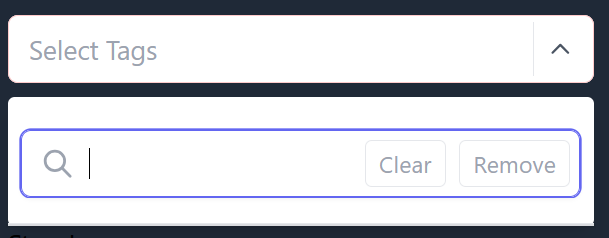
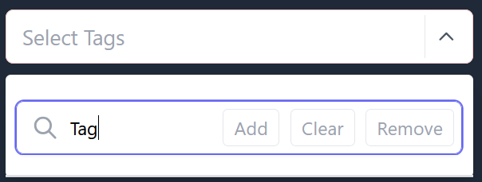
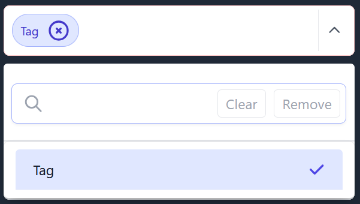

.. index:: how-to-quickstart ; Index

.. _how-to-quickstart:

=================
Tag-Me Quickstart
=================

**Minimum Requirements**

* Python version 3.10 or greater.
* Django 4.0 or greater.

Installation
============

**Install the 'django-tag-me' package using pip:**

.. code-block:: bash

   pip install django-tag-me

|

**Add `tag-me` to your installed apps.**

|

.. code-block:: python

    INSTALLED_APPS = [
    "tag_me",
    ]

|

Once installed, add the models and static files to your Django project:

|

.. code-block:: bash

    python3 manage.py makemigrations

    python3 manage.py migrate

|

**After successful migration, you should see output similar to the following in your console:**

|

.. code-block:: bash

        INFO    2024-04-03 07:40:47,367 INFO    MainThread       helpers.py:61
                 (/venv/lib/python3.12/site-packages/tag_me/utils/helpers.py :
                 61) tag_me.registry.save_fields: Successfully added tag-me Issue - Issue Visibility
        INFO    2024-04-03 07:40:47,369 INFO    MainThread        models.py:134
                 (/venv/lib/python3.12/site-packages/tag_me/models.py : 134)
                 tag_me.models.check_field_sync_list_lengths: Your field <visibilty> sync list has 2
                 required minumum elements with content id's [110, 120]

|

**Add Alpine.js and 'tag-me' scripts to your base.html**

*Alpine.js is a lightweight JavaScript framework that adds reactivity to your HTML. It's required for the 'tag-me' functionality.*

.. note::

   The CDN for the alpine components below may not be the latest. Please see https://alpinejs.dev/essentials/installation
   and https://alpinejs.dev/plugins/focus for the latest versions.

.. important::

   Ensure the Alpine Focus script is included before Alpine's core JS file, as per the Alpine Focus documentation!

|

.. code-block:: html

   <head>
   

   

   
   </head>

|

Usage
=====

|

**Add a 'tag-me' tag to your Django model.**

|

Tagging allows you to associate flexible keywords or categories with your model instance fields.  It is possible to have more than one model field with tagging functionality.

|

.. tip::

   While not required, adding a user-friendly `verbose_name` will improve the users experience. `verbose_name` is used throughout the 'tag-me' package as an identifier.

    If you dont provide a `verbose_name`, the Django default will be used.

|

.. code-block:: python

   from django.db import models
   from tag_me.models.fields import TagMeCharField

   class MyModel(models.Model)

       my_tagged_field = TagMeCharField(
           max_length=255,
           null=True,
           blank=True,
           verbose_name="My Tagged Field",  # User-friendly label
           help_text= "How to use tag-me TagMeCharField.",
           )

|

**Forms**

|

.. important::

   Use of the custom 'tag-me' form mixin is required for the tags widget to function correctly.

See below for an example.

|

.. code-block:: python

   from django import forms
   from tag_me.forms.mixins import TagMeModelFormMixin
   from tag_me.widgets import TagMeSelectMultipleWidget
   from .models import MyModel

   class MyModelForm(TagMeModelFormMixin, forms.ModelForm):

       class Meta:
           model = MyModel
           fields = ['my_tagged_field']

       widgets = {
            "my_tagged_field": TagMeSelectMultipleWidget(),
        }

|

The `AllFieldsTagMeModelFormMixin` will render every tagged field
as a widget onto the form that makes use of it.  An example use
for this mixin is for a search tool based on a users tags.

.. code-block:: python

   from django import forms
   from tag_me.forms.mixins import AllFieldsTagMeModelFormMixin
   from tag_me.widgets import TagMeSelectMultipleWidget
   from .models import MyModel

   class MyModelForm(AllFieldsTagMeModelFormMixin, forms.ModelForm):

       class Meta:
           model = MyModel

|

**Views**

|

.. important::

    Use of the custom 'tag-me' view mixin is required for the tags widget to function correctly.

See below for an example.

|

.. code-block:: python

    from django.views.generic import CreateView
    from tag_me.views.mixins import TagMeViewMixin
    from .forms import MyModelForm
    from .models import MyModel

    class MyModelCreateView(TagMeViewMixin, CreateView)
        model = MyModel
        form_class = MyModelForm
        etc ...

|

Creating Tags
=============

|

Using the widget
----------------

|

|

|

|

Choices
-------

|

You may use the model choices machinery to add a fixed set of tags.

|

.. warning::

    Using the model choices mechanism to define tags bypasses Django's built-in choices validation. This method provides a simple way to add fixed tags, and is a convenience for you, the developer.

    See example below.

|

.. code-block:: python

    from django.db import models
    from django.utils.translation import pgettext_lazy as _

    class MyModel(models.Model)

        class ApprovalStatus(models.TextChoices):
            """Approval Status choices."""

            APPROVED = "APPROVED", _(
                "Status",
                "Approved",
            )
            NOT_REVIEWED = "NOT_REVIEWED", _(
                "Status",
                "Not Reviewed",
            )
            REJECTED = "REJECTED", _(
                "Status",
                "Rejected",
            )

        my_tagged_field = TagMeCharField(
            max_length=255,
            choices=ApprovalStatus.choices,
            default=ApprovalStatus.NOT_REVIEWED,
            null=True,
            blank=True,
            verbose_name="My Tagged Field",
            help_text= "How to use tag-me TagMeCharField with choices.",
            )

|

.. important::

    During initialization, `TagMeCharField` internally converts your `choices` into a tag representation for seamless integration.

    Tags added using this method are automatically designated as ``system`` tags and users are unable to add to or modify them.

|

TemplateTags
============

|

We have a custom template tag designed to format tags elegantly across various views, 
such as detail and list views. By default, the tag output includes a trailing comma, which our 
template tag processes to ensure a cleaner presentation. Additionally, it wraps each tag in a 
visually appealing `pill` style element, mimicking the appearance of a traditional tag. 
This enhances the overall user experience by providing a consistent and attractive way to display tags.

|

Usage
-----

|

In your HTML template add the `tag_me_pills` templatetag like below.

|

.. code-block:: html

   }

   
  

   {{ obj.tagged_field|tag_me_pills }}
  

|

Default Tag Seed
----------------

There exists a means to add default tags during migrations using a json 
file located in BASE_DIR. The file must be named `default_user_tags.json`
and be in the following format.

.. code-block:: python

       {
       "<field_name>": [
            "<tag type>",  # must be user or system
            "csv tag string with trailing comma"
        ],
       }

       # Example

       {
        "field_1": [
            "user",
            "tag1,tag2,"
        ],
        "field2": [
            "system",
            "tag3,tag4,"
        ],
      }

Check config for settings options to seed default tags while migrating.

Undocumented Method
-------------------

There is a tag management tool for both the system and user tags.  ``Urls`` ``Views`` and ``Bad Templates`` exist.

The templates largely work but are more for example purposes.  This area needs more work and to be documented.

Please take a look at the code and Im pretty sure you will figure it out fairly quickly.
