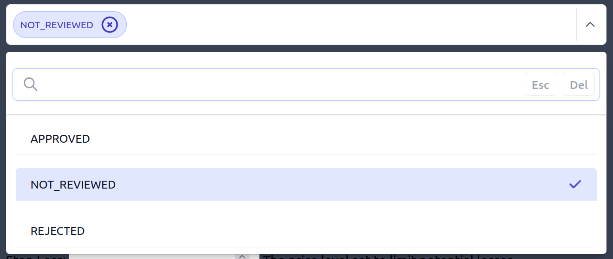
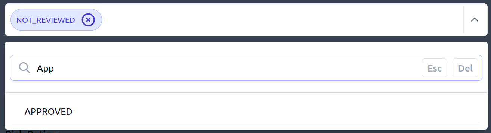

.. Django Tag Me documentation master file, created by
   sphinx-quickstart on Mon Sep 25 16:31:20 2023.
   You can adapt this file completely to your liking, but it should at least
   contain the root `toctree` directive.

Welcome to Django Tag Me documentation!
=======================================

How it looks in your forms!
---------------------------

|

**Dropdown with selection options.**

|

|

**Dropdown tag options search functionality.**

|

|

The lightweight and amazing dropdown has been adapted to work with tags from https://github.com/alexpechkarev/alpinejs-multiselect/

|

.. include:: ../../README.rst

.. toctree::
   :hidden:
   :titlesonly:

   how-to/index-how-to

.. toctree::
   :maxdepth: 2
   :caption: Contents:

Indices and tables
==================

* :ref:`genindex`
* :ref:`modindex`
* :ref:`search`
